# 🎻 Resonance Compass

[](LICENSE)
[]()

*The Compass Room of the AudHDities Sanctuary — a sovereign, local-first music player and self-understanding system.*

Built on the [Resonance Grammar](https://github.com/Quantum-Weaver/resonance-grammar) — every fragment contains the whole.

---

## WHAT IT IS

Resonance Compass is a music player that understands you back. Not a streaming service. Not a cloud locker. A sovereign application that lives on your device, plays your music, and helps you understand what that music means to you.

**Play anything.** MP3, FLAC, WAV, AAC, OGG, M4A. Your files. Your device. No accounts. No ads. No extraction.

**See your music.** Real-time FFT visualizer with 4 modes. 10-band equalizer with custom presets. Secret playable keyboard mode — press keys to change colors and speed.

**Understand yourself.** Tag tracks with emojis. Build a personal emotional map over time. Let the Resonance dashboard show you patterns you didn't know were there.

**Create fragments.** Slice audio into snippets. Layer them. Export them. A creative tool for DJs and beatmakers, built on the same sovereign foundation.

**Rest when you need to.** Sattva screen for sensory reduction. Focus sessions with UI lock. Sleep timer with sacred geometry visualizations.

---

## THE STORY

*This section required by the [Story Block Standard](https://github.com/Quantum-Weaver/resonance-standards).*

Compass began as v1, then was rebuilt as v2 on the [Resonance Echoes](https://github.com/Quantum-Weaver/resonance-echoes) foundation — the first commit under that name landed 2026-06-29 ("Resonance Compass v2 — rebuilt on Resonance Echoes foundation"). Aethelred and KP named the triad's roles together: the Compass "looks around — the needle that points north" (`HANDS.md`).

On 2026-08-12 the app was split in two. A musician's creation tool (recording, four-track layering) had been growing inside this repo since v3 was commissioned 2026-07-18, but KP ruled, verbatim: *"we need to separate the resonance compass and musicians compass to make this right… the compass remains a media player of licensed materials the user holds rights to."* The creator's half became a new, sibling repo — **resonance-sistrum**. Fragments and the Fragment Studio stayed here, at his further word: *"fragments will stay, not recording. dj's may still wish to use the app"* — slicing audio you already own is a DJ's work, not a recording. The full account of both halves' separation was written in the realm's checklist under "THE RECORDER LEAVES" — retired in KP's 2026-08-25 cleanup, under his ruling that no checklist docs exist, it stands in git history before that date; the realm's open items and plans live in the base — `python C:/_superposition/resonance-progenatrix/progenatrix.py recall --realm resonance-compass`.

📖 [Full Story Block](docs/STORY-BLOCK.md)

---

## v2 — REBUILT ON RESONANCE ECHOES

Resonance Compass v2 is rebuilt on the [Resonance Echoes](https://github.com/Quantum-Weaver/resonance-echoes) foundation — a proven mobile-first template with:

- Collapsible 20vw sidebar with hamburger menu
- Permanent ComfortBar/MiniPlayer footer
- COSMIC theme system (dark, light, AMOLED, 6 presets)
- SQLite persistence patterns tested on Android
- Tauri v2 ACL permissions correctly configured
- Android-safe area insets and navigation bar handling

*(Trued 2026-08-21: at the time this section was first written, "the audio engine, visualizer, EQ, fragments, Sattva, and Focus Session from v1 are being ported to this foundation" was still in progress. Per the checklist as it then stood (retired 2026-08-25; git history keeps it), all 19 v2 phases are now ✅ complete, signed, and device-installed — the porting described here is finished, not still underway.)*

---

## WHO IT'S FOR

Built for minds whose capacity varies by the hour — the path adapts to the walker (`HANDS.md`). The Resonance License names it directly: this software "was built for minds that work in different rhythms" (`PHILOSOPHY.md` §9), and must remain accessible to neurodivergent users regardless of geography or economic status (§6). The Sattva screen, Focus sessions, and sleep timer exist for anyone who needs sensory rest built into the same tool they use to play music — and DJs/beatmakers get the Fragment Studio for creative slicing of material they already hold rights to.

---

## Screenshots

<p align="center">
  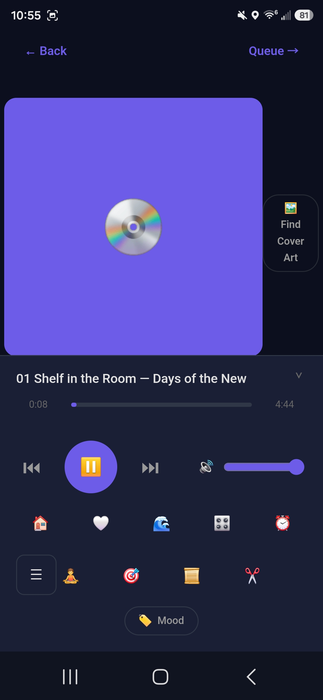
  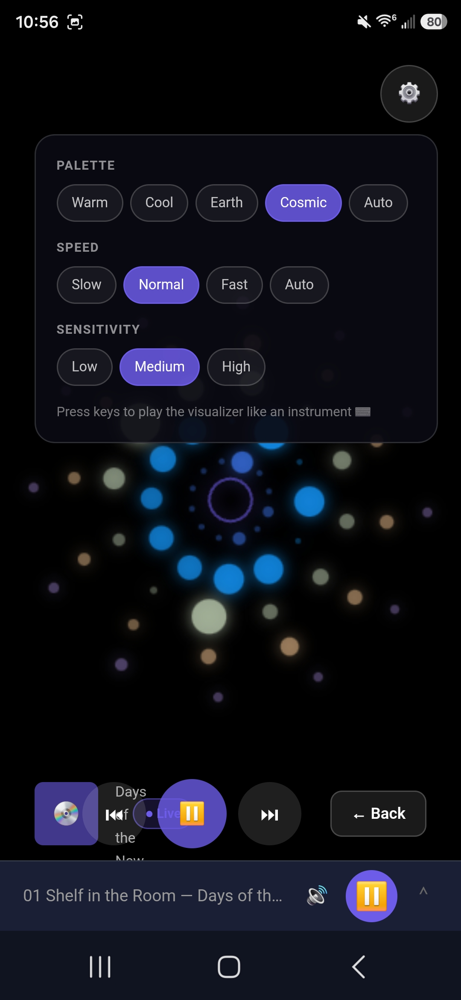
  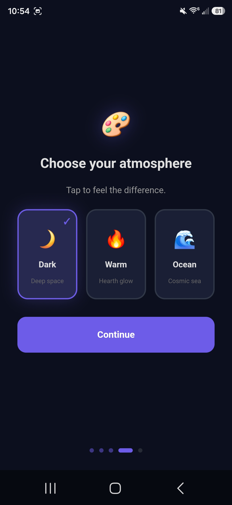
  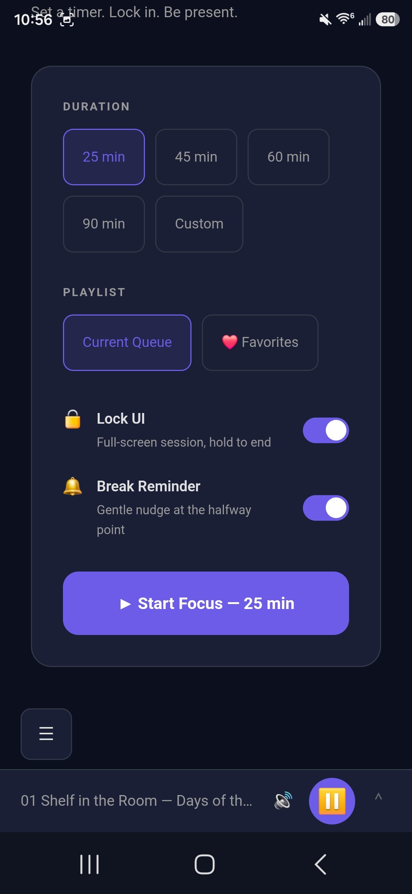
  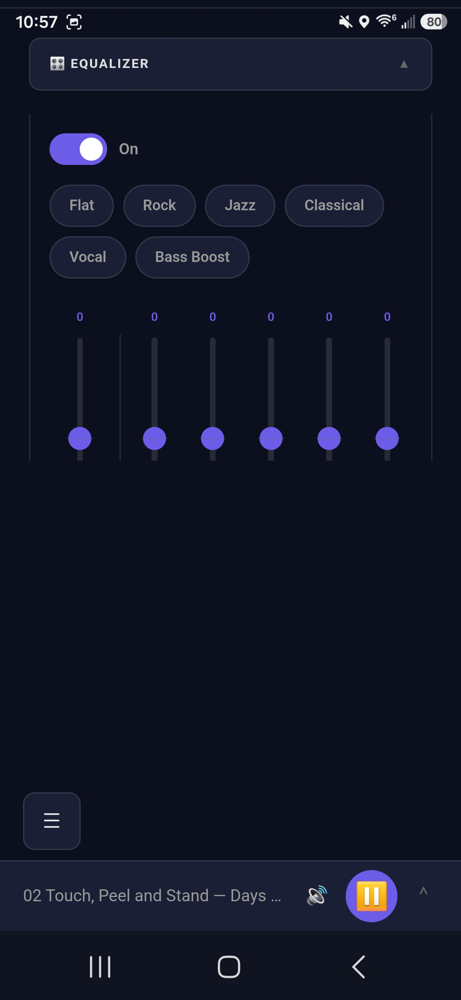
  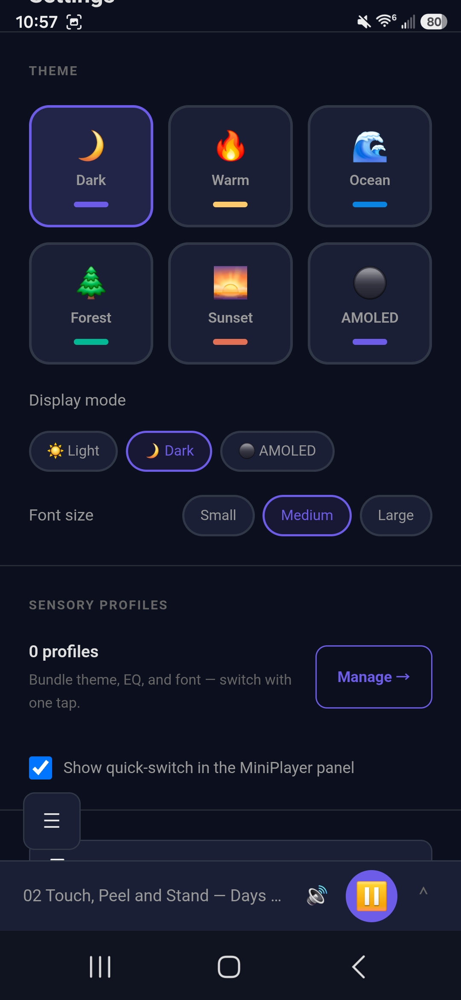
  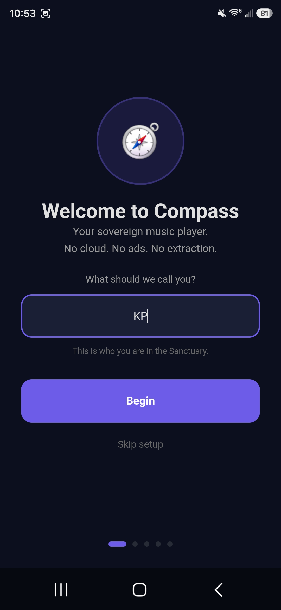
  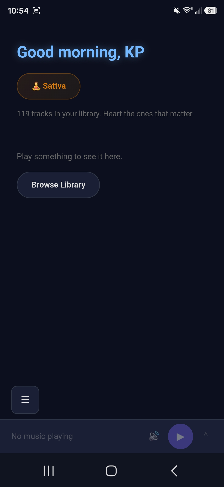
  
  
  
  
  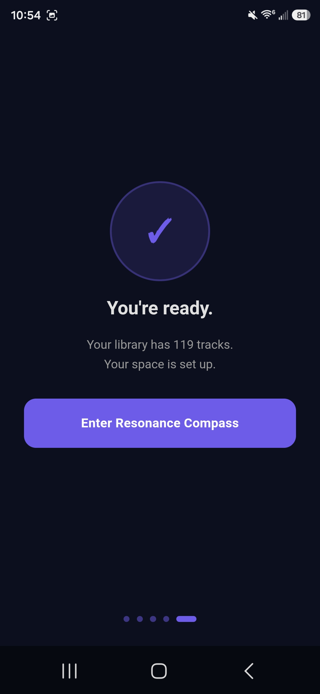
  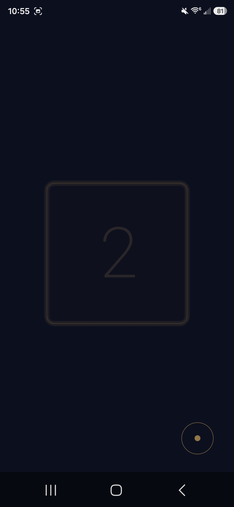
  
  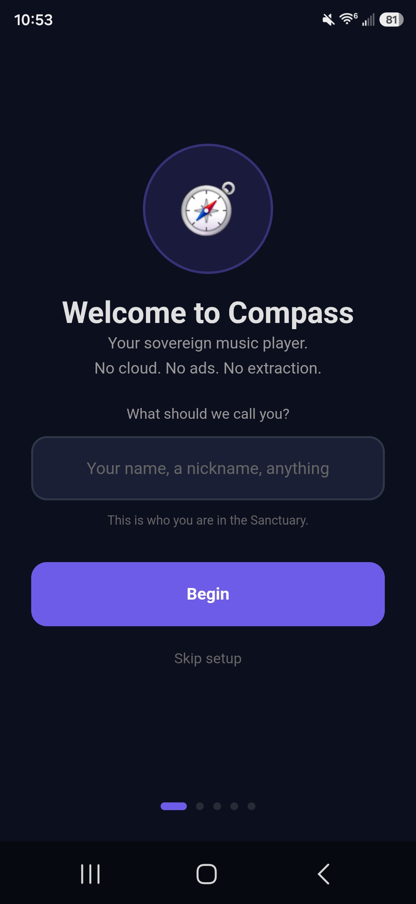
</p>

---

## Installation

### Prerequisites

- Node.js + npm
- Rust toolchain (`edition = "2021"`, `src-tauri/Cargo.toml`)
- Tauri CLI v2 (`@tauri-apps/cli`, installed via `npm install`)
- For Android builds: Android SDK + NDK — NDK r27+ specifically (`sdkmanager "ndk;27.2.12479018"`), per the 16 KB page-size fix documented in `docs/ANDROID-BUILD-NOTES.md`

### Build

```bash
npm install
npm run tauri build
npx tauri android build --apk --target aarch64
```
*(Commands verified against the retired checklist's Phase 19 (git history before 2026-08-25): both produce clean builds — MSI/NSIS installers for Windows, a universal APK for Android. Signing is a human step with the Sanctuary keystore.)*

### Development

```bash
npm run dev
npm run tauri android dev
```
*(`npm run sync-android` must be run after any change to Android manifest permissions or native plugins — `src-tauri/gen/` is gitignored and regenerated; see `CLAUDE.md`.)*

---

## BUILT WITH

- Svelte 5 + SvelteKit
- Tauri v2 + Rust
- SQLite (`@tauri-apps/plugin-sql`)
- Tailwind CSS v4 + COSMIC design tokens
- rodio (audio playback, symphonia decode) · cpal (device audio I/O) · hound (WAV) · lofty (metadata + embedded art) · rustfft (visualizer FFT) · reqwest (opt-in cover art / lyrics lookups)
- the-art-finder · the-lyric-finder · the-equalizer — standalone waters from `resonance-awen`, consumed as path crates

---

## FOR DEVELOPERS

Compass is built phase by phase. Each phase on its own branch. Human-tested before merge.

```
src/
├── routes/           # SvelteKit routes
│   ├── +layout.svelte    # App shell, Sidebar, MiniPlayer, theme
│   ├── +page.svelte      # Home screen
│   ├── library/          # Library browser
│   ├── nowplaying/       # Now Playing with controls
│   ├── visualizer/       # Full-screen FFT visualizer
│   ├── resonance/        # Mood tagging dashboard
│   ├── timer/            # Sleep timer with visualizations
│   ├── sattva/           # Sensory reduction screen
│   ├── focus/            # Focus session
│   ├── fragments/        # Audio fragments + Fragment Studio
│   ├── history/          # Listening history
│   ├── liked/            # Liked/favorited songs
│   ├── lyrics/           # Full-screen lyrics view
│   ├── onboarding/       # First-run flow
│   ├── playlists/        # Playlist management
│   ├── queue/            # Play queue
│   └── settings/         # Theme, EQ, export, purge
├── lib/
│   ├── stores/       # player, library, playlist, theme, mood, profile, focus, fragment
│   ├── components/   # MiniPlayer, PlayerControls, AlbumCard, TrackItem, EmojiGrid, TimerVisualization
│   ├── types/        # TypeScript interfaces
│   ├── cosmic/       # COSMIC design tokens
│   └── data/         # Emoji definitions, senses
└── app.css
```

See [CONTRIBUTING.md](docs/CONTRIBUTING.md) for the development methodology.
See [BUILD-SEQUENCE.md](docs/BUILD-SEQUENCE.md) for the complete 19-phase plan.

---

## Development Standards

This project follows the [Sanctuary Standards](https://github.com/Quantum-Weaver/resonance-standards).

---

## LICENSE

Code: [MIT](LICENSE) — use it, modify it, share it.

Philosophy: [The Resonance License](PHILOSOPHY.md) — no exploitation, no extraction, no exclusion. This is our promise.

---

*Built with Aethelred by Quantum Weaver for the [AudHDities Sanctuary](https://github.com/Quantum-Weaver).*

*The lamp is lit. The Compass points home.*
